# ☕ Домашние задания к OTUS'овскому курсу «Java-разработчик. Базовый курс»

Коллекция домашек к курсу OTUS [«Java разработчик. Базовый уровень»](https://otus.ru/lessons/java-basic/).

## Структура

```text
src/ru/mishe1/homeworks/
  hw4/
  hw6/
  hw6_5/
  hw8/
  hw11/
  hw12/
  hw12_5/
  hw14/
  hw16/
  hw23/

index-hw19.html
```

В папке `src/ru/mishe1/homeworks/` лежат Java-решения по отдельным домашним работам.

## Домашние работы

|     | Работа                                        | Тема                                      | Что отрабатывается                                              | Краткое описание                                                                                                             |
| --- | --------------------------------------------- | ----------------------------------------- | --------------------------------------------------------------- | ---------------------------------------------------------------------------------------------------------------------------- |
| 1.  | [`hw4`](src/ru/mishe1/homeworks/hw4/)         | Первое Java-приложение                    | JDK, `javac`, `java`, `Scanner`, `Base64`                       | Консольная программа считывает имя пользователя и выводит результат Base64-кодирования.                                      |
| 2.  | [`hw6`](src/ru/mishe1/homeworks/hw6/)         | Консольная система тестирования           | Массивы, циклы, условия, ввод с консоли                         | Первая версия quiz-приложения: вопросы, варианты ответов и подсчёт результата реализованы процедурно.                        |
| 3.  | [`hw6_5`](src/ru/mishe1/homeworks/hw6_5/)     | Рефакторинг quiz-приложения               | Многомерные массивы, смешанные типы, индексы                    | Данные вопросов, правильных ответов и вариантов собраны в одну структуру, чтобы уменьшить расхождение параллельных массивов. |
| 4.  | [`hw8`](src/ru/mishe1/homeworks/hw8/)         | Quiz в ООП-стиле                          | Классы, объекты, разделение ответственности                     | Та же задача тестирования переписана через объекты: вопросы, ввод, вывод и запуск quiz отделены друг от друга.               |
| 5.  | [`hw11`](src/ru/mishe1/homeworks/hw11/)       | Сортировка чисел                          | Коллекции, `ArrayList`, `Comparable`, bubble sort               | Учебная реализация сортировки для массива примитивов и списков с числами/строками.                                           |
| 6.  | [`hw12`](src/ru/mishe1/homeworks/hw12/)       | Банк и клиентские счета                   | Коллекции, поиск по ключу, связи между объектами                | Модель банка хранит клиентов и счета, поддерживает поиск всех счетов клиента и поиск клиента по счёту.                       |
| 7.  | [`hw12_5`](src/ru/mishe1/homeworks/hw12_5/)   | Доработка банковской модели               | ООП, коллекции, перенос ответственности                         | Альтернативная версия банковской модели, где связь счёта с клиентом частично переносится ближе к объекту клиента.            |
| 8.  | [`hw14`](src/ru/mishe1/homeworks/hw14/)       | Игра «Угадай число»                       | Исключения, `try/catch`, `AutoCloseable`, пользовательский ввод | Консольная игра с обработкой некорректного ввода, выходом по команде `exit` и демонстрацией собственных исключений.          |
| 9.  | [`hw16`](src/ru/mishe1/homeworks/hw16/)       | Тесты для игры в кости                    | Основы тестирования, проверки, поиск ошибок                     | Самописный минимальный test harness для проверки классов `DiceImpl` и `Game`; тесты должны находить ошибки в заготовке.      |
| 10. | [`task_hw17.pdf`](docs/reports/task_hw17.pdf) | PostgreSQL-схема для системы тестирования | PostgreSQL, DDL, таблицы, внешние ключи, SQL-запросы            | Проектирование БД для quiz-системы: таблицы вопросов и ответов, тестовые данные и запросы для проверки результата.           |
| 11. | [`index-hw19.html`](index-hw19.html)          | Таблица студентов в браузере              | HTML, CSS, JavaScript, DOM                                      | Небольшая web-страница: таблица студентов, форма добавления новой записи и пересчёт среднего возраста.                       |
| FIN | [`hw23`](src/ru/mishe1/homeworks/hw23/)       | Проект «Цена прописью»                    | Строки, декомпозиция, тестируемость, форматирование             | Финальная работа: число переводится в русские слова, а валюта подбирает правильную форму слова.                              |

## Как запустить Java-решения

Репозиторий исторически хранит решения как набор Java-файлов без отдельной системы сборки. Самый простой способ — открыть проект в IDE и запускать нужный `HomeWork` / `Homework` class из соответствующего пакета.

Для запуска из терминала можно компилировать отдельную работу из корня репозитория.

Пример для HW4:

```bash
javac -encoding UTF-8 src/ru/mishe1/homeworks/hw4/HomeWork.java
java -cp src ru.mishe1.homeworks.hw4.HomeWork
```

Пример для работы, где несколько Java-файлов в одной папке:

```bash
javac -encoding UTF-8 src/ru/mishe1/homeworks/hw11/*.java
java -cp src ru.mishe1.homeworks.hw11.HomeWork
```

Пример для финального проекта HW23 с вложенными пакетами:

```bash
javac -encoding UTF-8 $(find src/ru/mishe1/homeworks/hw23 -name "*.java")
java -cp src ru.mishe1.homeworks.hw23.Homework
```

HTML-работу можно открыть локально в браузере:

```bash
open index-hw19.html
```

## Подробный обзор домашних работ

### 1. HW4. Первое Java-приложение

**Папка:** [`src/ru/mishe1/homeworks/hw4`](src/ru/mishe1/homeworks/hw4/)  
**Код:** [`HomeWork.java`](src/ru/mishe1/homeworks/hw4/HomeWork.java)

Первая работа фиксирует стартовый Java-workflow: установить JDK и IDE, скомпилировать класс через `javac`, запустить программу через `java`, затем оформить результат через pull request.

Программа запрашивает имя пользователя через `Scanner`, кодирует введённую строку в Base64 и печатает результат в консоль.

**Комментарий:** работа простая, но хорошо показывает минимальный цикл: написать класс, принять ввод, вызвать стандартную библиотеку и получить результат в консоли.

#### Отчёт

<a href="docs/reports/report_hw4.png">
  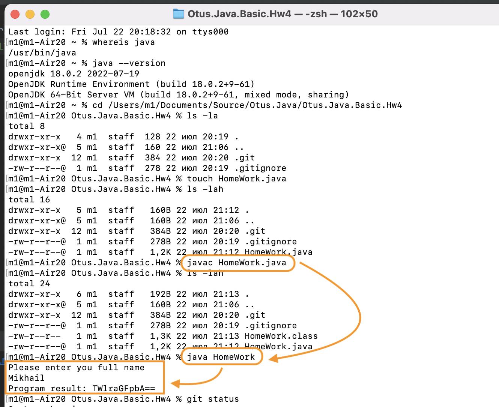
</a>

<a href="docs/reports/report_hw4-1.png">
  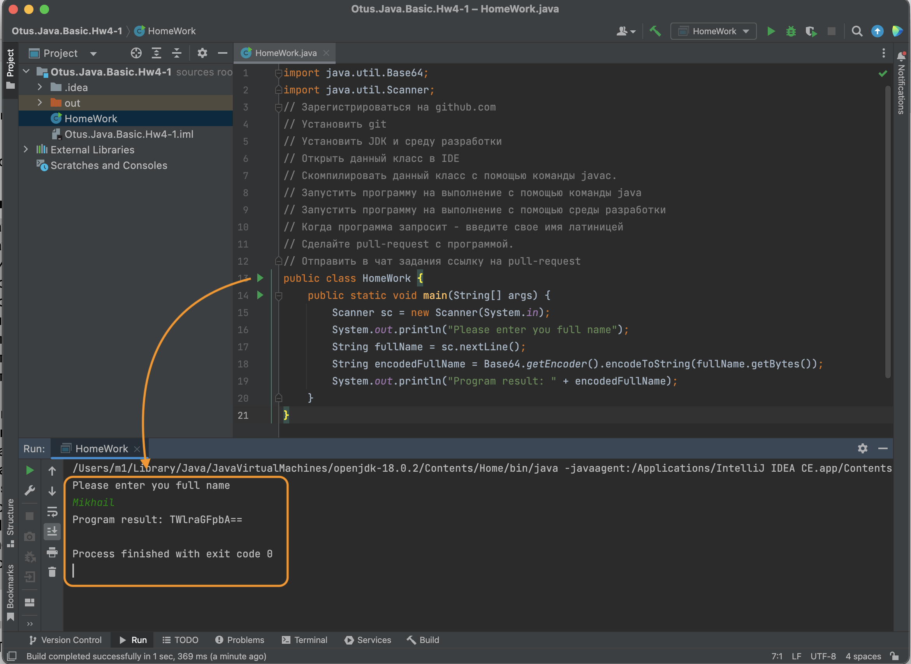
</a>

### 2. HW6. Консольная система тестирования

**Папка:** [`src/ru/mishe1/homeworks/hw6`](src/ru/mishe1/homeworks/hw6/)  
**Код:** [`HomeWork.java`](src/ru/mishe1/homeworks/hw6/HomeWork.java)

Реализована консольная система тестирования: программа выводит вопрос и варианты ответа, пользователь вводит номер ответа, после прохождения всех вопросов выводится количество правильных и неправильных ответов.

Данные вопросов, вариантов и правильных ответов хранятся в отдельных массивах. Решение намеренно не использует ООП, потому что работа закрепляет уже пройденные на тот момент конструкции: массивы, циклы, условия и ввод с консоли.

**Комментарий:** пример раннего процедурного решения. В нём хорошо видно, как быстро параллельные массивы начинают требовать аккуратной синхронизации индексов.

### 3. HW6.5. Рефакторинг quiz-приложения

**Папка:** [`src/ru/mishe1/homeworks/hw6_5`](src/ru/mishe1/homeworks/hw6_5/)  
**Код:** [`HomeWork.java`](src/ru/mishe1/homeworks/hw6_5/HomeWork.java)

Доработка предыдущей работы: данные вопроса, правильного ответа и вариантов ответа собраны в одну структуру. В коде используются индексные константы `QUESTION_INDEX`, `CORRECT_ANSWER_INDEX` и `ANSWERS_INDEX`, чтобы явно обозначить смысл ячеек.

**Комментарий:** решение всё ещё учебное и процедурное, но уже показывает первый шаг к связному представлению данных: вопрос и его ответы хранятся рядом, а не расползаются по нескольким массивам.

### 4. HW8. Quiz в ООП-стиле

**Папка:** [`src/ru/mishe1/homeworks/hw8`](src/ru/mishe1/homeworks/hw8/)  
**Код:** [`HomeWork.java`](src/ru/mishe1/homeworks/hw8/HomeWork.java)

Та же задача системы тестирования переписана в ООП-стиле. В коде появляются отдельные сущности для вопроса, quiz-сценария, пользовательского ввода и вывода.

**Комментарий:** работа показывает переход от процедурного кода к объектной модели. По сравнению с HW6/HW6.5 код становится легче расширять: можно менять вопросы, ввод или вывод без полной переписки основного сценария.

### 5. HW11. Сортировка чисел

**Папка:** [`src/ru/mishe1/homeworks/hw11`](src/ru/mishe1/homeworks/hw11/)  
**Код:** [`HomeWork.java`](src/ru/mishe1/homeworks/hw11/HomeWork.java), [`Sorter.java`](src/ru/mishe1/homeworks/hw11/Sorter.java)

Реализована учебная сортировка через `Sorter.bubbleSort`. В демонстрации сортируются:

- массив `int[]`;
- `ArrayList` с числами;
- `ArrayList` со строками.

**Комментарий:** работа закрепляет стандартные коллекции, интерфейс `Comparable` и различие между массивами примитивов и коллекциями объектов.

#### Отчёт

<a href="docs/reports/report_hw11.png">
  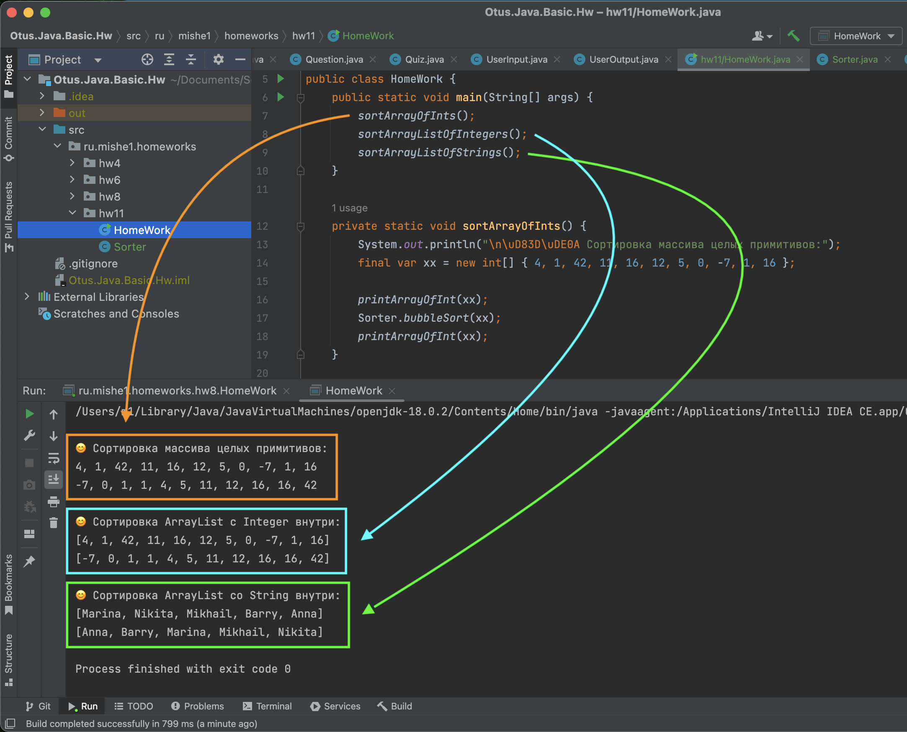
</a>

### 6. HW12. Банк и клиентские счета

**Папка:** [`src/ru/mishe1/homeworks/hw12`](src/ru/mishe1/homeworks/hw12/)  
**Код:** [`HomeWork.java`](src/ru/mishe1/homeworks/hw12/HomeWork.java)

В работе реализована модель банка: есть клиенты, счета и хранилище связей между ними. Требование задачи — быстро находить все счета по клиенту и клиента по счёту с использованием стандартных коллекций Java.

В демонстрационном сценарии создаются несколько клиентов, добавляется дополнительный счёт, после чего выполняются оба направления поиска.

**Комментарий:** работа полезна как упражнение на выбор структуры данных. Здесь важна не только объектная модель, но и то, какие коллекции использовать для быстрого доступа по ключу.

#### Отчёт

<a href="docs/reports/report_hw12.png">
  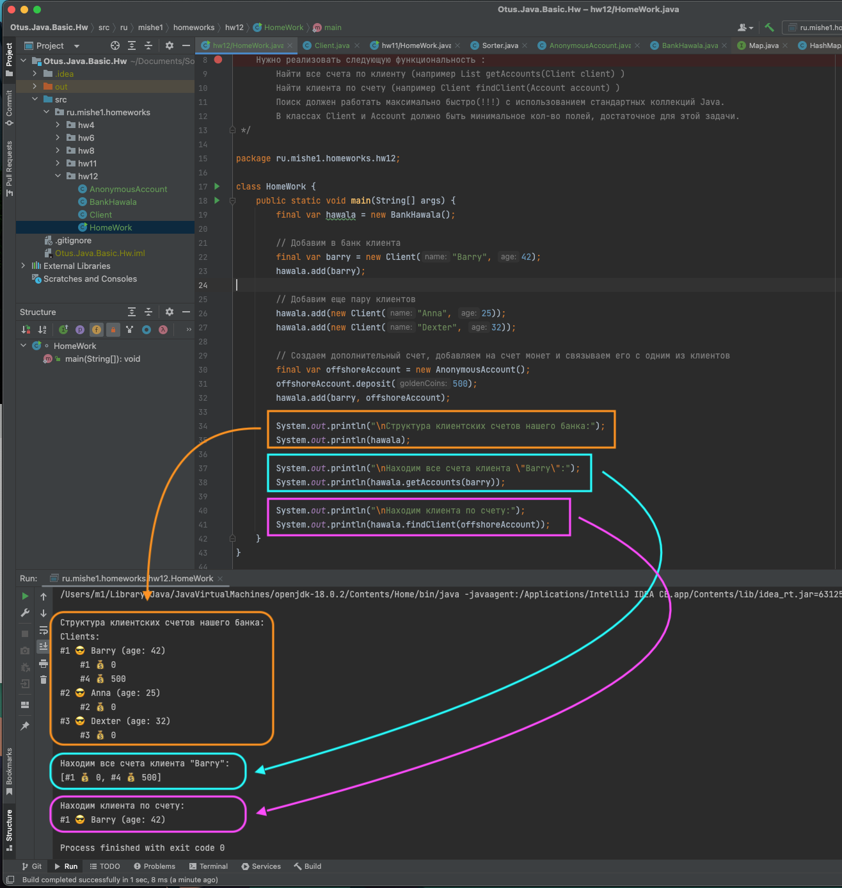
</a>

### 7. HW12.5. Доработка банковской модели

**Папка:** [`src/ru/mishe1/homeworks/hw12_5`](src/ru/mishe1/homeworks/hw12_5/)  
**Код:** [`HomeWork.java`](src/ru/mishe1/homeworks/hw12_5/HomeWork.java)

Альтернативная версия банковской задачи. В этой итерации связь нового счёта с клиентом добавляется через объект клиента (`barry.addAccount(offshoreAccount)`), а не только через внешний объект банка.

**Комментарий:** небольшая, но важная архитектурная разница: часть ответственности переносится ближе к доменной сущности. Это хороший повод сравнить два варианта модели — централизованное управление связями через банк и более объектный подход через клиента.

### 8. HW14. Игра «Угадай число»

**Папка:** [`src/ru/mishe1/homeworks/hw14`](src/ru/mishe1/homeworks/hw14/)  
**Код:** [`GuessTheNumberGame.java`](src/ru/mishe1/homeworks/hw14/GuessTheNumberGame.java)

Консольная игра «Угадай число». Игрок вводит число, программа сравнивает его с загаданным значением и подсказывает, больше или меньше нужно искать. Также поддерживается команда `exit`.

В работе отдельно обработаны разные сценарии ошибок: некорректный ввод, выход пользователя, runtime-ошибка. Класс игры реализует `AutoCloseable`, чтобы показать гарантированное выполнение завершающего действия.

**Комментарий:** это хороший пример учебного применения исключений: не просто поймать ошибку, а разделить разные типы ситуаций и по-разному на них реагировать.

### 9. HW16. Тесты для игры в кости

**Папка:** [`src/ru/mishe1/homeworks/hw16`](src/ru/mishe1/homeworks/hw16/)  
**Код:** [`HomeWork.java`](src/ru/mishe1/homeworks/hw16/HomeWork.java)

В заготовке есть игра в кости: два игрока бросают кубик, выигрывает тот, у кого результат больше. Задача — написать минимум четыре теста для классов `DiceImpl` и `Game`, причём тесты должны найти не менее двух ошибок.

В решении есть отдельные папки `assertions`, `tests` и `otus`, а запуск тестов вынесен в `AllTests.run()`.

**Комментарий:** работа фиксирует важный переход: код проверяется не только ручным запуском, но и отдельными тестами. Даже без JUnit появляется структура проверки, assertion-helpers и разделение production/test-кода.

#### Отчёт

<a href="docs/reports/report_hw16.png">
  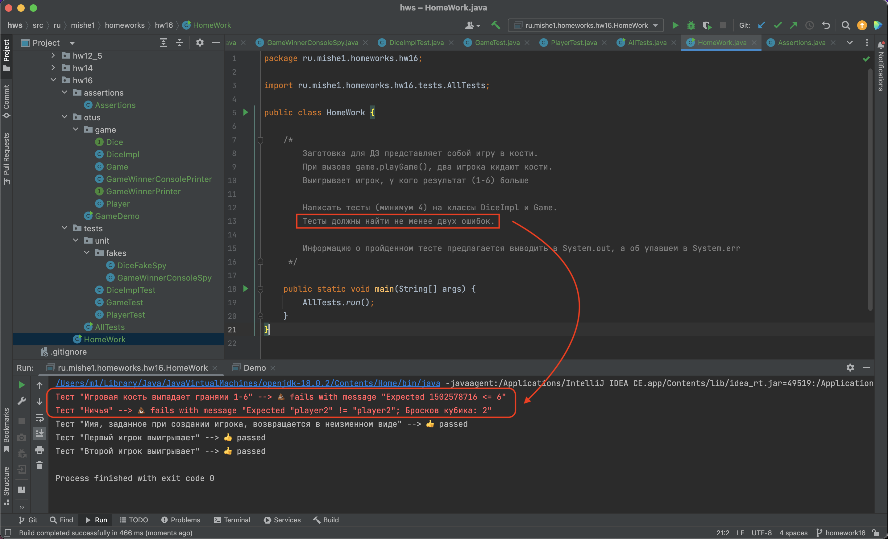
</a>

### 10. HW17. PostgreSQL-схема для системы тестирования

Работа посвящена проектированию схемы базы данных для консольной системы тестирования из предыдущих домашних работ. В задании нужно было локально установить PostgreSQL, подготовить DDL-скрипты и сохранить вопросы вместе с вариантами ответов.

#### Задание

<a href="docs/reports/task_hw17.png">
  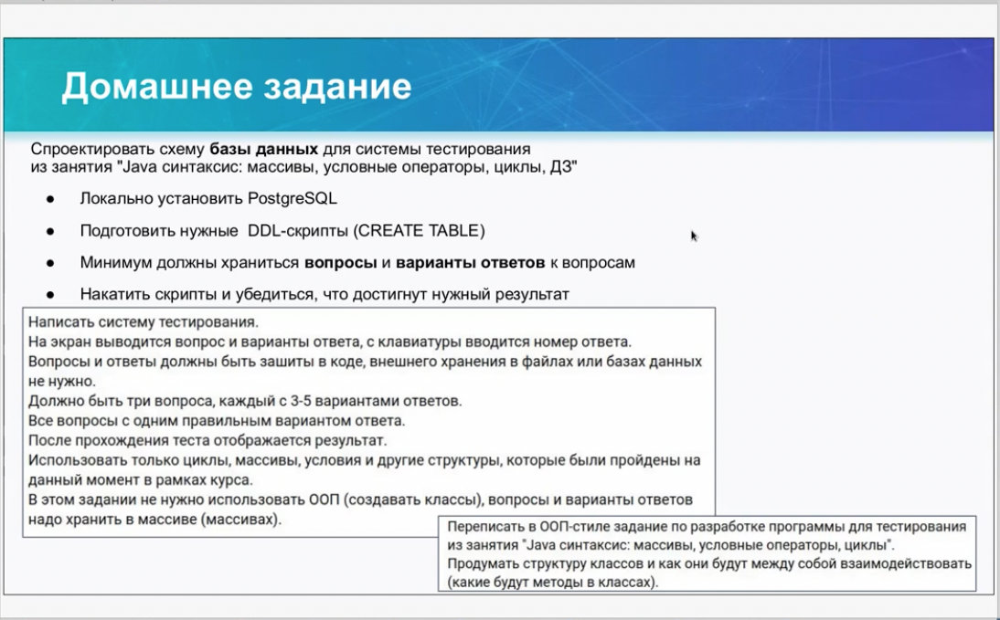
</a>

**Описание задания:** [`task_hw17.pdf`](docs/reports/task_hw17.pdf)

В сохранённом PDF зафиксирован SQL-сценарий: создание базы `quiz`, таблиц `questions` и `answers`, добавление тестовых данных, выборка вопросов и ответов, проверка правильного ответа по `id`, `LEFT JOIN` и запрос списка вопросов с правильными ответами.

**Комментарий:** это переход от Java-кода к хранению данных в реляционной базе. Домашка показывает базовую модель quiz-системы: отдельная таблица вопросов, отдельная таблица вариантов ответов и связь между ними через внешний ключ.

#### Отчёт

<a href="docs/reports/report_hw17.png">
  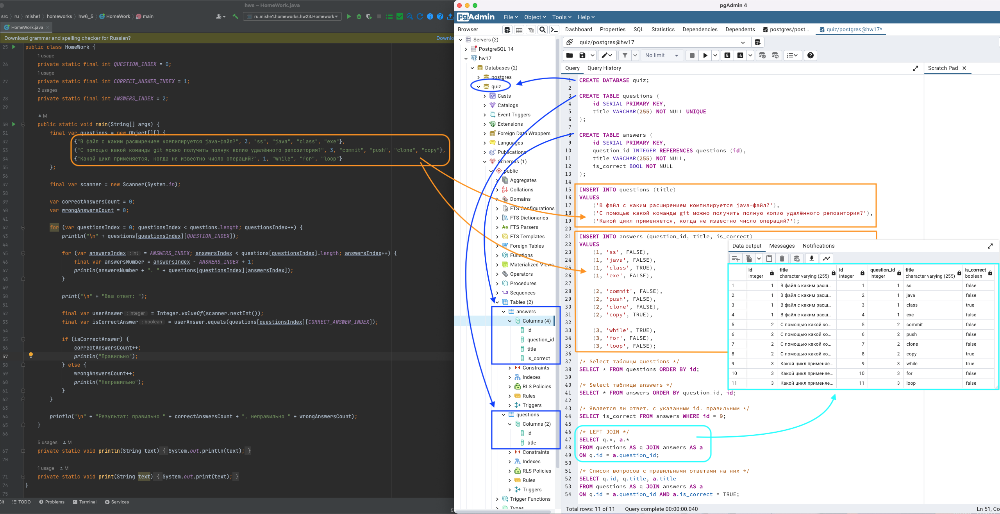
</a>

### 11. HW19. Таблица студентов в браузере

**html/css + js:** [`index-hw19.html`](index-hw19.html)

#### Задание

<a href="docs/reports/task_hw19.png">
  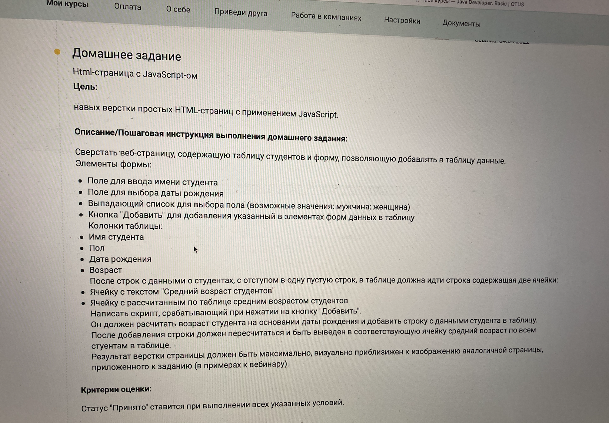
</a>

Небольшая HTML-страница со встроенными CSS и JavaScript. На странице есть таблица студентов, форма добавления новой записи, выбор пола, дата рождения и автоматический пересчёт среднего возраста.

JavaScript-часть работает с DOM: читает значения из формы, валидирует ввод, добавляет строку в таблицу и пересчитывает средний возраст по значениям в колонке.

**Комментарий:** это отдельная web-вставка внутри Java-курса: работа показывает базовые приёмы фронтенда без сборщиков и фреймворков.

### HW23. Финальная мини-работа «Цена прописью»

**Папка:** [`src/ru/mishe1/homeworks/hw23`](src/ru/mishe1/homeworks/hw23/)  
**Код:** [`Homework.java`](src/ru/mishe1/homeworks/hw23/Homework.java)

Финальная работа курса: программа принимает число и выводит его прописью на русском языке с правильной формой валюты. Например: `5 -> пять рублей`, `3 -> три рубля`, `45 -> сорок пять рублей`.

Решение разделено на formatter для числа и formatter для валюты. В демонстрации используются рубли и доллары, а также проверяется большое значение вплоть до `Integer.MAX_VALUE`.

**Комментарий:** это самая полноценная работа в репозитории: есть декомпозиция, тестируемость, отдельные assertion/test-пакеты и учёт расширения на другие валюты.

#### Отчёт

<a href="docs/reports/report_hw23.png">
  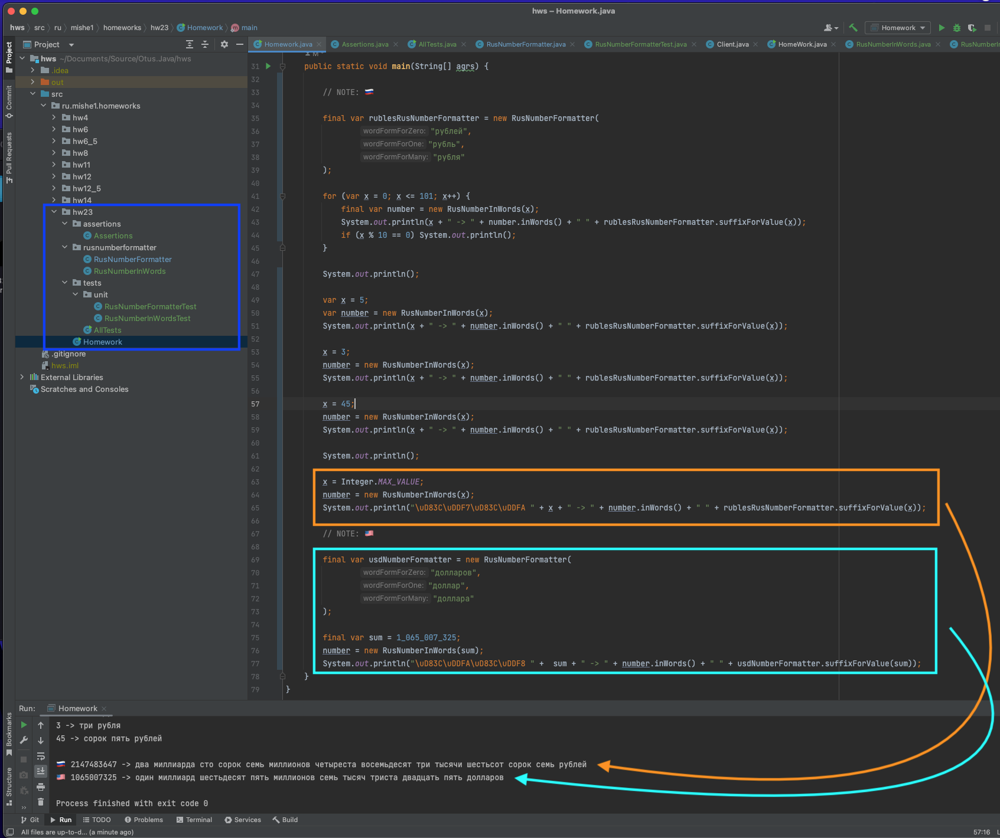
</a>

<a href="docs/reports/report_hw23-1.png">
  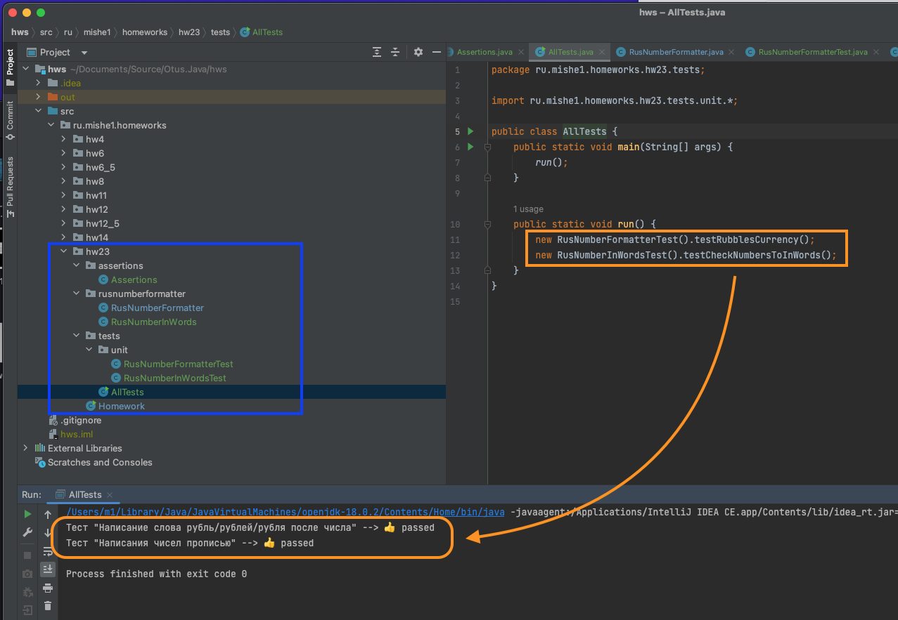
</a>

## Сертификат

<a href="docs/otus.java.basic.png">
  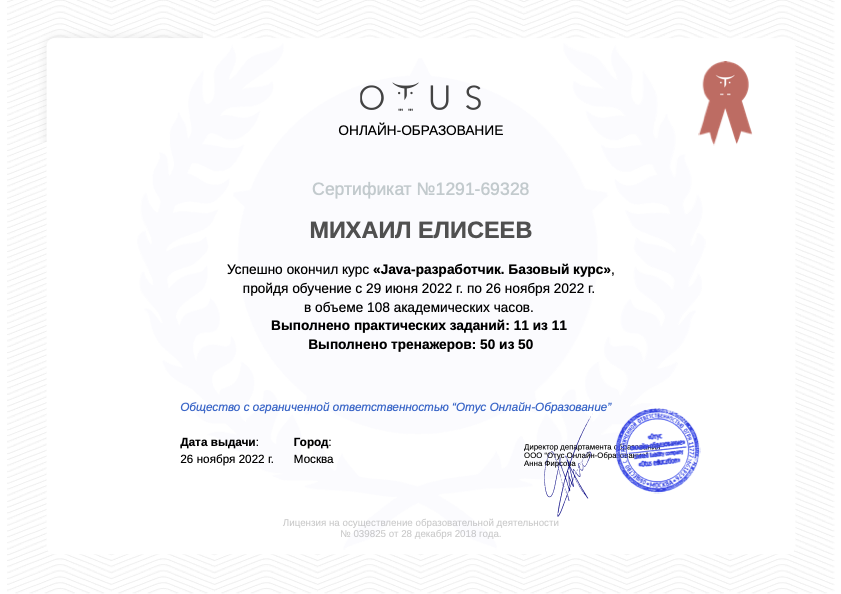
</a>
